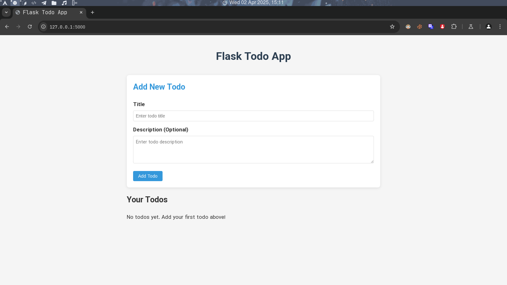

# Flask Todo App

A simple Todo List application built with Flask and SQLAlchemy.

## Demo Screenshot



## Features

- Create, Read, Update, and Delete todos
- Mark todos as completed/uncompleted
- Responsive design with clean UI

## Installation

1. Clone the repository
```
git clone https://github.com/yourusername/flask-todo-app.git
cd flask-todo-app
```

2. Create and activate a virtual environment
```
python -m venv venv
source venv/bin/activate  # On Windows, use: venv\Scripts\activate
```

3. Install the required packages
```
pip install -r requirements.txt
```

4. Run the application
```
python app.py
```

5. Open your browser and navigate to `http://127.0.0.1:5000`

## Technologies Used

- Flask
- SQLAlchemy
- SQLite
- HTML/CSS

## Project Structure

```
flask_todo_app/
├── app.py                # Main application file
├── static/
│   └── style.css         # CSS styles
├── templates/
│   ├── index.html        # Main page
│   └── edit.html         # Edit todo page
├── requirements.txt      # Required packages
└── README.md             # Project documentation
```

## License

MIT 